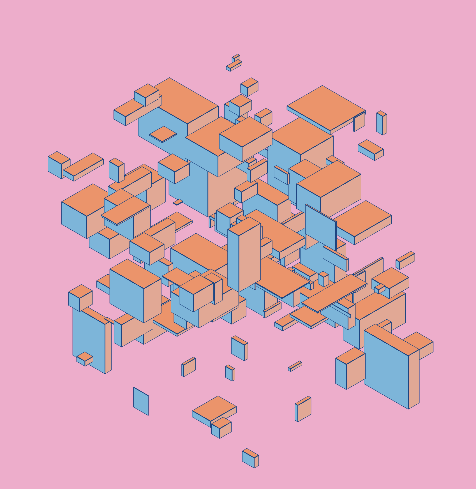
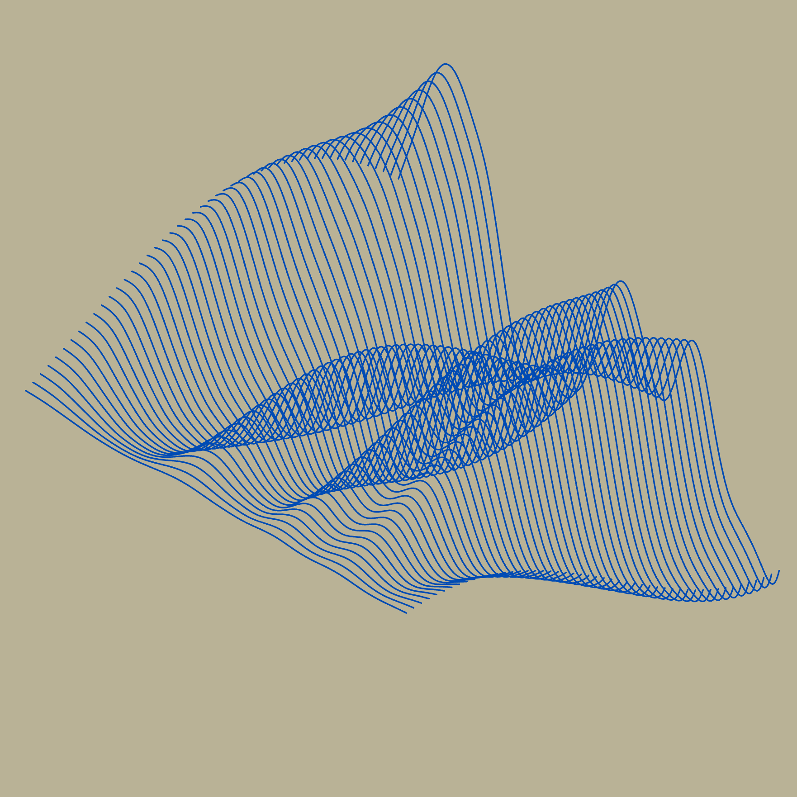
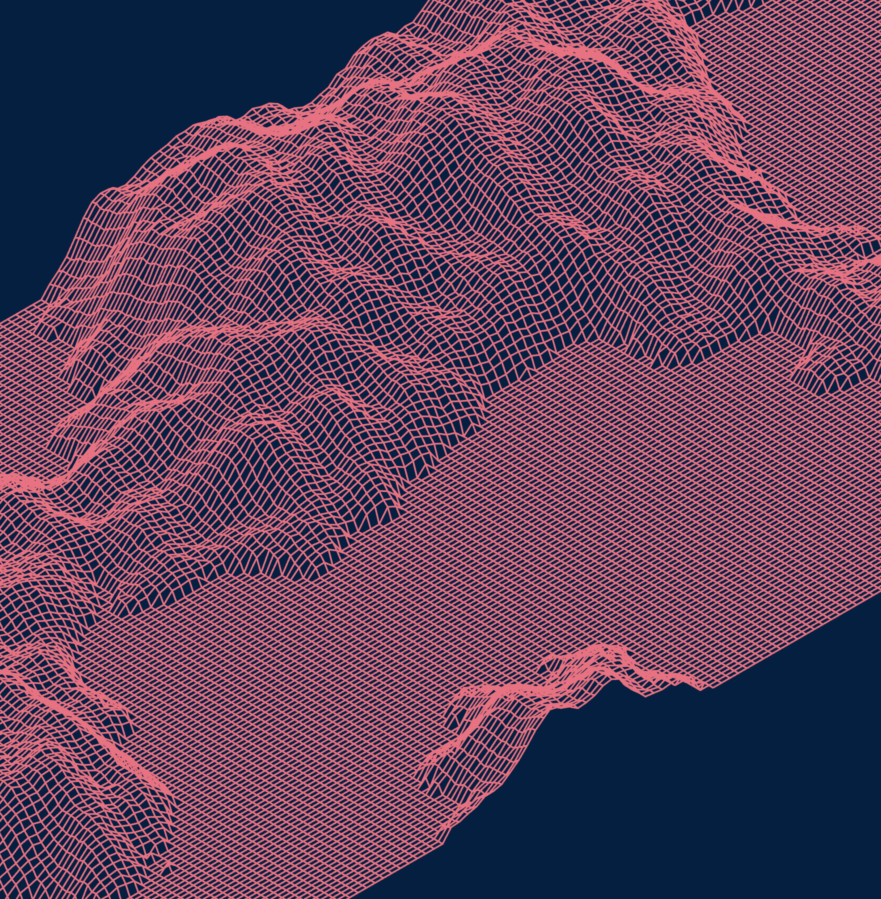
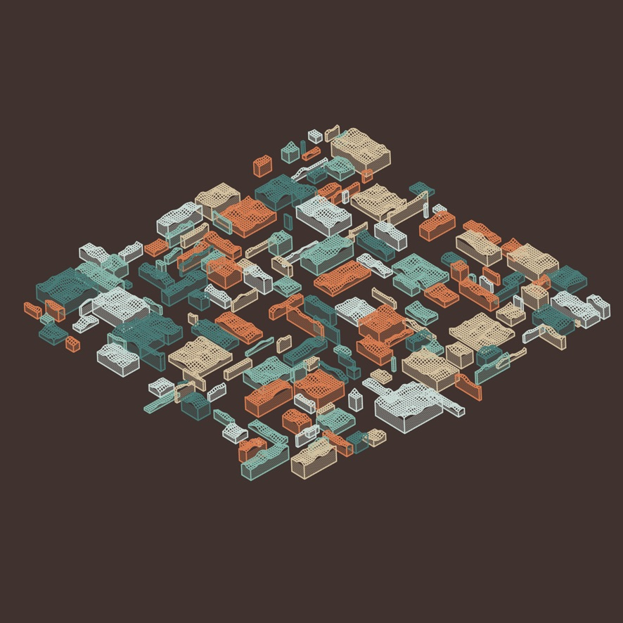

# Code Sketches - Sep 2021

A series of code sketches from September 2021. This application uses react. Most sketches were created using [Three.js](https://threejs.org/) and [@react-three/fiber](https://docs.pmnd.rs/react-three-fiber/getting-started/introduction).

## Todo

- [ ] Add some output images
- [ ] Add individual readmes for each sketch (optional)
- [ ] Add title / description SEO stuff

## CS 210917 - 17 Sep 2021

## CS 210918 - 18 Sep 2021

## CS 210919 - 19 Sep 2021

## CS 210920 - 20 Sep 2021

[📼 Timelapse Video](https://www.youtube.com/watch?v=GVJP7jzwH6g)

Note: as seen in the video, this sketch used to be named CS15, befure I changed the naming format.

## CS 210921 - 21 Sep 2021

[📼 Timelapse Video](https://www.youtube.com/watch?v=GVJP7jzwH6g)

Note: as seen in the video, this sketch used to be named CS16, befure I changed the naming format.

## CS 210925 - 25 Sep 2021

## CS 210926 - 26 Sep 2021

## CS 210927 - 27 Sep 2021

## CS 210928 - 28 Sep 2021

## CS 210929 - 29 Sep 2021

