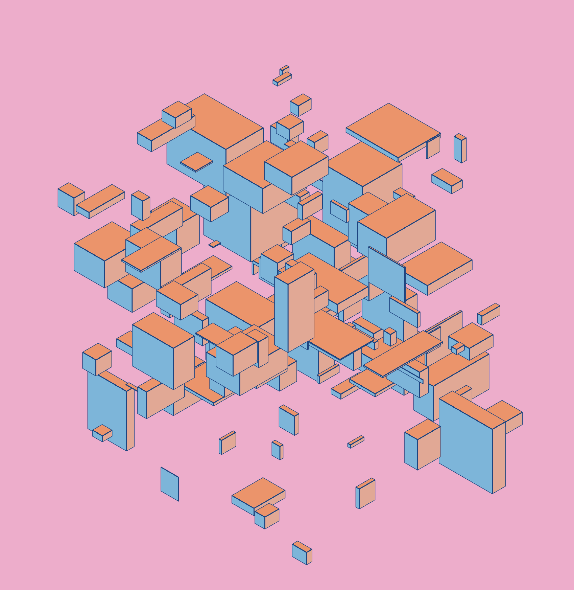

# Code Sketches - Sep 2022

A series of code sketches from September 2022. This application uses react. Most sketches were created using [Three.js](https://threejs.org/) and [@react-three/fiber](https://docs.pmnd.rs/react-three-fiber/getting-started/introduction).

## Todo

- [ ] Add some output images
- [ ] Add individual readmes for each sketch (optional)
- [ ] Add title / description SEO stuff

## CS 220917 - 17 Sep 2022

## CS 220918 - 18 Sep 2022

## CS 220919 - 19 Sep 2022

## CS 220920 - 20 Sep 2022

## CS 220921 - 21 Sep 2022

## CS 220925 - 25 Sep 2022

## CS 220926 - 26 Sep 2022

## CS 220927 - 27 Sep 2022

## CS 220928 - 28 Sep 2022

## CS 220929 - 29 Sep 2022

